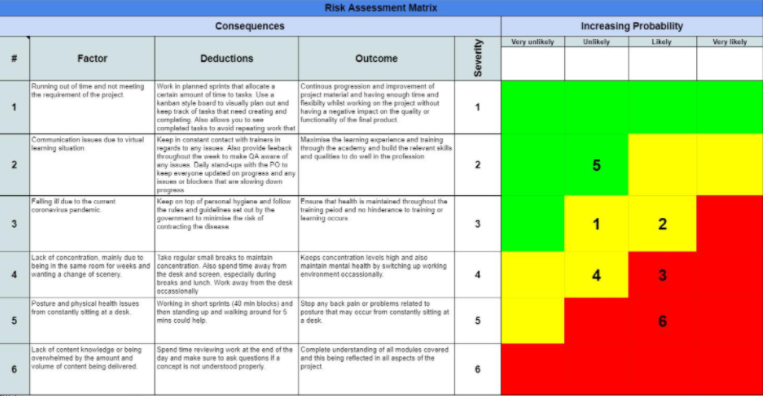
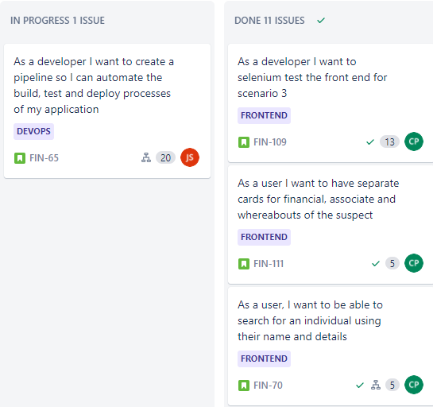
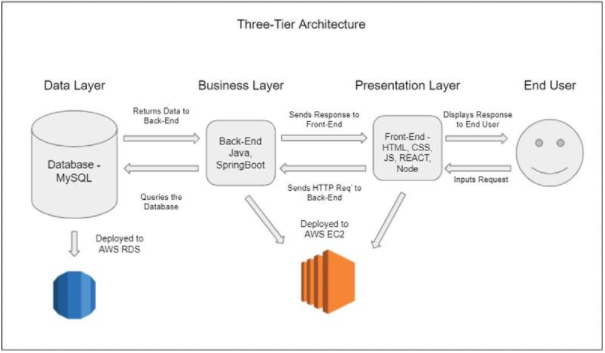
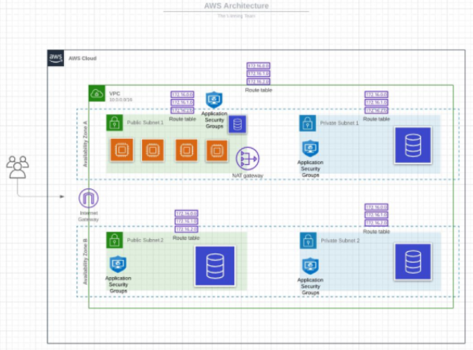
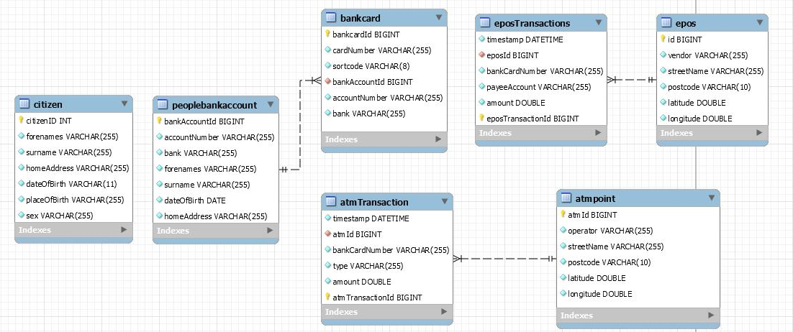
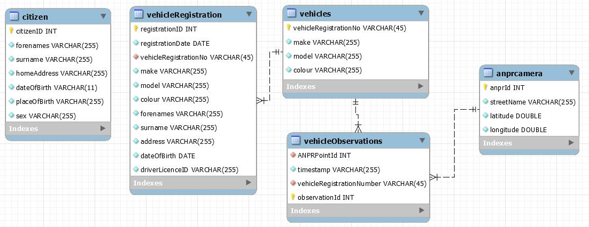
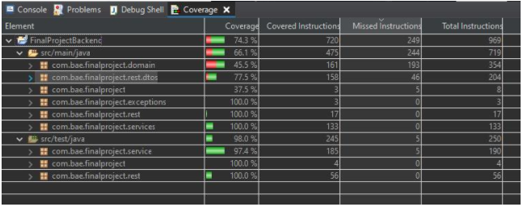
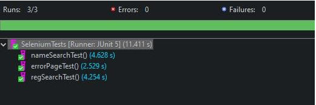
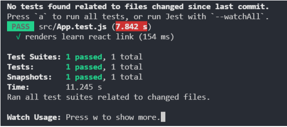

# The-Winning-Team-for-This-Project
# Final group project for QA Academy

<link to jira>
<link to backend/frontend>

## Brief
> Our customer works at an investigation unit. They have access to some data provided by a third-party provider *(name withheld for protection)*.
The provider has gathered information such as call records, financial transactions and ANPR sightings. The data is in a raw CSV format. Our customer needs an interface for exploring this data.

### Scenario 1: A person has been detained
> A suspect has been detained. Our customer needs to find some background context.
They only have the suspect’s name and would like to search the data to determine more information about the suspect’s background for example:
- Biographical Information
- Associates
- Financial transactions
- Whereabouts

### Scenario 2: An incident has occurred
> The customer is investigating an incident at a particular location. They need to find out who was in the area at that time.

### Scenario 3: Suspect flees the scene
> A suspect is spotted fleeing the scene of an incident in a car by an officer. The customer has the vehicle's number plate and must narrow down suspects using the reported number plate and find out where else they have been.

## Planning

### Risk Assessment
 

At the beginning of this project we identified and classified the risks and discussed what would cause failure of the project. Throughout the project, we monitored for risk triggers and stayed open and communicative when it came to risk status.

### Jira
 
At the start of the project as a team we agreed on epics, stories and tasks on Jira. We then used planning poker to justify and agree on our story points.
We then planned and prioritized the backlog into sprints (two sprints of four days each). After the first sprint, we gave a demo to our Product Owner and reviewed any outstanding tasks and changes that needed to be done.

### Wireframes
The frontend team used wireframes and drawings to decide on components needed to begin the project. See some of these here:
<https://github.com/the-winning-team-for-this-project/frontend/tree/main/planning>

## Solutions
Out team completed the first and third scenarios in the time given, and have added the second as a stretch goal.

### Scenario 3 
Scenario 3 was the first to be completed and this was all done within the first sprint. 
The application allows a user to input a registration and be taken to a profile page that displays all of the vehicular information, including ANPR data.
Whilst not part of the specification, we decided to add a map to view the latitude and longitude to make the experience more user friendly.

### Scenario 1
This was our second scenario to be completed, done within the second sprint.
This part of the application is designed to take a forename and surname input and return a list of possible matches to that name. The name card then links through to a profile showing banking details, including EPOS transactions and ATM machine information. To meet the brief in the limited time, we took a descision only to include banking data. A future improvement would be to include cell data information on this profile page.

## Architecture Diagram

This is a diagram which shows the basic structure of our application. It's a three-tiered application, with a data layer, a buisness layer and a presentation layer. 
The data layer is our database, a MySQL database hosted on a AWS RDS instance. The business layer is our backend, written in Java and utilising the SpringBoot framework, and the 
presentation layer is our front end, what the end user will see, and its written in HTML, CSS, JavaScript, and React. The business layer and the presentation layer are both
hosted on AWS EC2 instances. 

words about this here

## Database 
We set up our database in the following manner:

Setting up the database involved SSH’ing onto our Bastion machine, connecting to the database and importing the datafiles. The CSV files were then imported from the S3 bucket (on AWS) and used on our VMs. 

  

The diagrams above are Entity Relationship Diagrams, which show how the different tables are connected to each other

## Testing

### Integration Testing
We used MOCKMVC for integration testing.

### Unit Testing
We used Mockito for unit testing.

### Selenium

The frontend has been isolated and functionally tested locally (on a branch called 'Test' on the frontend) using a Json-Server endpoint with dummy data. Both of the completed scenarios have been tested with an extra test to simulate a bad URL and being taken to a 404 page.

### Snapshot Testing (React)

The snapshot testing was carried out once all of the frontend coding was finished. This checks the present state of the React application compared to a previous version to detect any changes in the code.

## Deployment/ Infrastructure
Talk about pipelines, terraform, ansible here

## Technologies Used
### Backend
- Java/Spring Boot
- MySQL
- H2
- Maven

### Frontend
- React
- json-server
- HTML/CSS/Javascript

### Deployment
- Jenkins
- AWS
- Ansible
- Terraform

### Misc
- Git/Github
- Jira

## Application Limitations
- Short time frame- with a wider time frame, further scenarios could have been completed and more features could be added to existing scenarios.
- Restricted access to the database.
- All of us are junior developers working on project, meaning we didn't have guidance from senior developers like we would in a real life scenario.
- limited time with Project Owner.
- Working remotely - would be much easier if we were in the same room

## Problems we’ve faced
- Connected the database, establishing relationships with the data and ensuring access restriction
- Running out of time

## Things we've handled well
- Thought about the product owner

## Stretch Goals/ Improvements
- Split architecture into microservices for ease of development. 
- Dockerising the product
- Complete further elements of each scenario, ideally complete all scenarios. 
- Add more detail and information to the front-end, making the application more visually appealing and smoother to use. 
- Develop the application further to hide irrelevant personal data on screen when a person is searched. 
- Tidy up the databases- some issues eg where the first entry is the name of the column because of importing troubles. Data types need to be tweaked a little (dates saved as strings)

## Developers on the Project
- Cara Prestwich
- Emily Nixon
- Joseph Woodward
- Junaid Sidat
- Emma Gray

## Acknowledgements
- Krystal Ryan
- Jordan Harrison
- All the QA Trainers 
